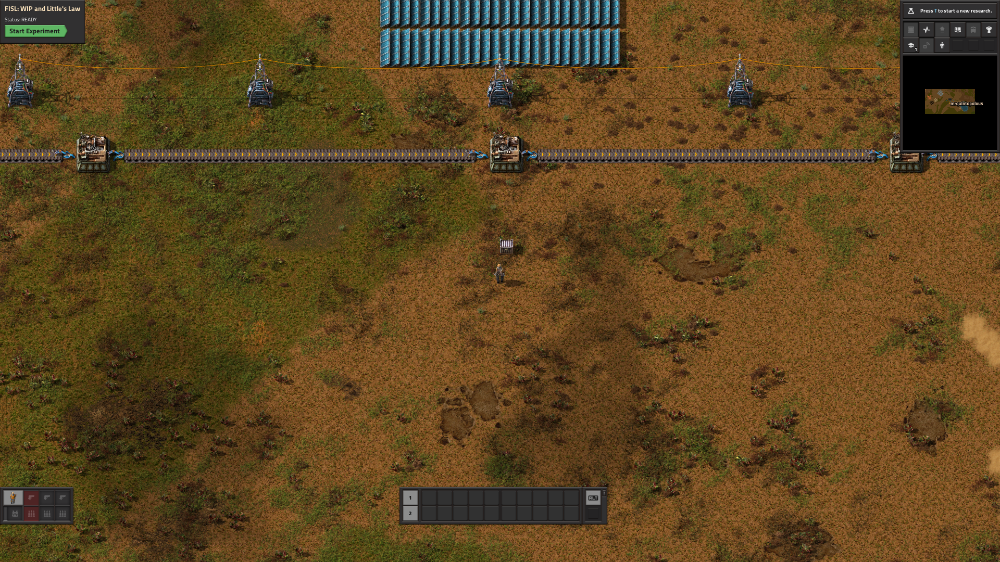
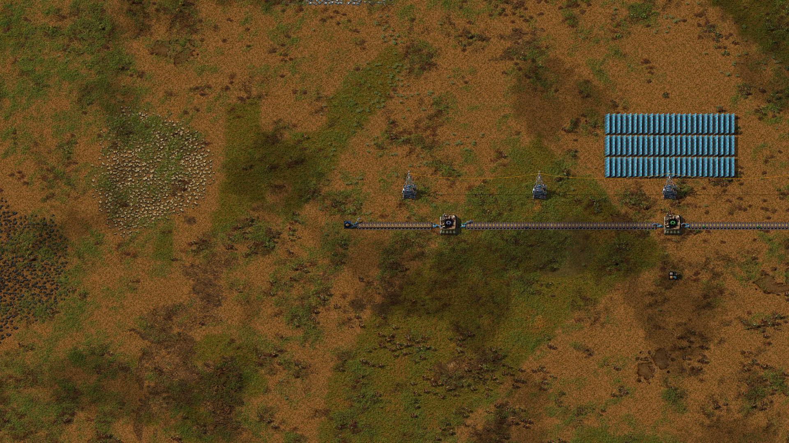
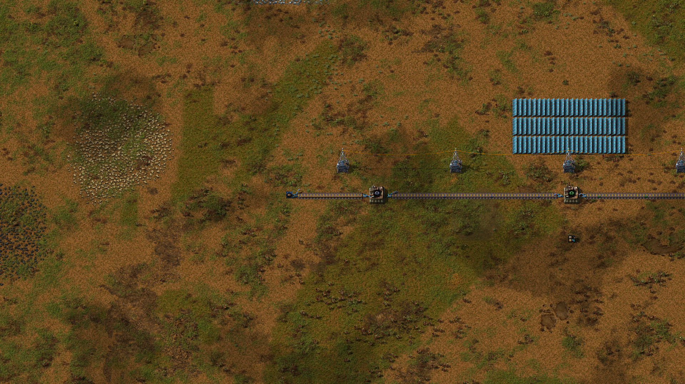

# Lab 3 — WIP and Little's Law

**Scenario:** `fp-03-littles-law` · two runs of ~12 minutes each

You will operate a small workpiece line twice: first exactly as you find it,
then after making one modification. Between the two runs, three numbers —
inventory, output rate, and flow time — will rearrange themselves in a way
that is not a coincidence, and the law that binds them is the subject of
this lab.

## The system

A conveyor line runs west to east: a blue **source** chest where raw
workpieces enter the system, three machines that transform them in stages
(rough → machined → inspected → finished), and an orange **sink** chest
where finished work leaves. The source and sink are laboratory equipment —
indestructible, and the exact points where FISL counts material entering
and leaving. A toolbox chest near your spawn holds spare belts, inserters,
and machines; its contents are ordinary materials and are never counted in
any measurement.

Three quantities are measured, all against the same declared boundary:

- **WIP** (work in process): workpieces that have entered at the source and
  not yet left at the sink — wherever they physically are: on belts, in
  machine buffers, mid-craft, even in your pockets.
- **Throughput (TH):** finished workpieces leaving through the sink, per
  minute, over the measured window.
- **Cycle time (CT):** how long a workpiece spends inside the system.

During the run you can see only the current WIP. Everything else is
withheld until the experiment ends — instrumentation that announces the
answer would spoil the diagnosis.

## Run 1 — observe

<!-- TODO(screenshots): drop PNGs into course/images/lab-03/ and uncomment.
{#fig-ready width=60%}
-->

Start the experiment and *don't change anything*. Spend the twelve minutes
walking the line (hold **Alt** for the detail overlay):

- Follow the belt west from the middle. What state is the first belt
  segment in? Estimate how many workpieces are sitting on it.
- Watch each machine for thirty seconds. Which one is always busy? What are
  the other two doing most of the time?
- Watch the WIP number on the panel. Is it moving?

Afterward, read your report (`fisl report runs/<run-id>`). A reference run
of this exact scenario produced:

| Metric | Value |
|---|---|
| average WIP | 51.70 work units |
| throughput | 15.00 / min |
| cycle time (derived) | 206.78 s |

Now a calculation you can do in your head: total *processing* time per
workpiece — the time machines actually spend working on it — is about
**8 seconds** (4 + 2 + 2). Yet each workpiece spent **207 seconds** inside
the system. Where were the other 199 seconds?

You walked past the answer: the packed input belt. Over 95% of each
workpiece's life was spent *waiting in a queue*, and nearly all of the
system's inventory was that queue.

<!-- TODO(screenshots): drop PNGs into course/images/lab-03/ and uncomment.
{#fig-jam}
-->

## The theory you just watched

Multiply throughput by cycle time, in consistent units:

$$
0.25\ \text{workpieces/s} \times 206.78\ \text{s} = 51.70\ \text{workpieces}
$$

That is your average WIP, exactly. This is **Little's Law**:

$$
\text{WIP} = \text{TH} \times \text{CT}
$$

It holds for any stable flow system with a declared boundary — factories,
hospitals, ticket queues, software teams — with no assumptions about what
happens inside. It is an accounting identity of flow, and you have now
measured all three of its terms simultaneously in a system you could walk
around in.

Read it as a constraint: the three quantities are not independent. If
throughput is pinned by a bottleneck (yours is: the first machine can only
do one workpiece per 4 s, i.e. 15/min), then **WIP and cycle time are the
same decision**. Carry 52 units of inventory and your flow time *must* be
~207 s. Want a 30-second flow time? Then you may hold at most
$0.25 \times 30 = 7.5$ units of WIP — no clever routing can evade this.

## Run 2 — intervene

The queue exists because the source inserter admits work as fast as it can
swing, while the bottleneck consumes one workpiece per 4 s. The fix is not
a faster machine — it's admitting work at the rate the system actually
consumes it. Factorio's circuit network lets you build exactly that.

One question decides everything: **where should the signal watch?** The
queue forms where work waits — immediately upstream of the bottleneck. A
gate anywhere else only stops the queue growing past the gate; everything
between the gate and the machine still packs solid.

Start a new run, and **before pressing Start**:

1. Walk to the source inserter (beside the blue chest).
2. Select the **red wire** tool from the shortcut strip (bottom right;
   enable it via the `…` menu if hidden).
3. Click the inserter, then click a belt tile **about halfway to the first
   machine** — circuit wire only reaches 9 tiles, and the full span is 10,
   so the wire needs one relay hop. Then click the **last belt tile before
   the first machine's input inserter**. Press **Q** to put the wire away.
   (If a click refuses to attach the wire, you're stretching past its
   reach — pick a closer tile.)
4. Open the **last** belt tile (the gate): enable **Read belt contents**,
   mode **Hold**. Open the halfway tile too and make sure *its* circuit
   options are all off — it only carries the wire.
5. Open the source inserter: set **Enable/disable** with the condition
   *rough workpiece < 2*. (Why 2 and not 1? The belt trip from the source
   takes ~5 s while the machine eats one workpiece per 4 s — a staging
   allowance of one extra piece covers the travel time so the bottleneck
   never starves. Try 1 later and watch what happens to throughput.)

<!-- TODO(screenshots): drop PNGs into course/images/lab-03/ and uncomment.
{#fig-gate}
-->

You have built a *pull signal*: a workpiece is admitted only while fewer
than two are staged at the machine. Press Start and watch the same twelve
minutes — the belt stays nearly empty, and the WIP number tells the story
live.

Then compare your two attempts:

```sh
fisl compare runs/<run-1> runs/<run-2>
```

Predict before you look: what happened to throughput? To WIP? To cycle
time? Check every prediction against the deltas — and check that Little's
Law still binds all three numbers in run 2.

::: {.callout-warning}
## If your WIP only dropped ~20%…

…your gate is watching a tile near the *source*. Walk the line: everything
downstream of your monitored tile is still packed. The signal must watch
the point where the queue actually forms. This exact mistake was made by
the first version of this lab's own reference solution — it measured
avg WIP 41.66 instead of ~17. Diagnosing a control system by *walking the
physical line* is itself the skill being taught here.
:::

::: {.callout-warning}
## If nothing changed *at all*…

…your wire never connected. An inserter with an enable condition but no
circuit network **ignores the condition completely** — the run comes out
identical to the baseline, down to the last decimal. The usual cause is
wire reach: a red wire spans at most 9 tiles, and the direct
inserter-to-gate span here is 10, so it needs the relay hop from step 3.
Walk the wire and check both segments are actually drawn. This, too, was a
mistake the reference solution made (version 2 wired the distance directly;
the script reported success and changed nothing). A control system has two
halves — the *decision* and the *actuation path* — and configuring the
first does nothing without the second.
:::

**And why doesn't WIP go to ~2?** Walk the line in run 2 and count what's
left: one or two workpieces staged at the gate, a few *moving* on belts,
one inside each machine. This line is ~90 tiles long — about 48 s of pure
belt travel — so even a perfect pull system must carry
$\text{TH} \times \text{transit} \approx 0.25 \times 48 \approx 12$
workpieces of in-transit inventory. **Conveyors are inventory.** The
run-1 queue was waste; the run-2 residual is transportation. Little's Law
prices both identically.

## Debrief

- Throughput did not change. Why not? What *would* change it?
- Nearly all cycle time in run 1 was queueing. Is queue time always waste?
  What did the big queue *buy* the system, if anything, in this
  deterministic world? (Hold this question — it returns with force when
  variability enters the course.)
- The intervention limited admission, not capacity. Name a real system you
  know that controls flow time this way — and one that instead lets the
  queue grow.
- Your factory processed work in 8 s but delivered in 207 s. If a customer
  asked "why does my order take so long," what is the honest answer?

## What the simulation assumed away

This world is deterministic: machines never fail, never vary, and the
supply never fluctuates. In such a world a large input queue is *pure*
waste — it buys nothing. Real systems hold inventory partly to absorb
variability, and whether a buffer is waste or insurance is the central
question of the variability course that follows. Do not conclude from this
lab that all inventory is bad; conclude that inventory has a *price
denominated in flow time*, and that the price is exact: CT = WIP / TH.

<!-- TODO(figure): generate with
  fisl solutions scenarios/factory-physics/fp03-littles-law --run --svg course/data/lab-03-comparison.svg
then uncomment. This figure regenerates from run data — never hand-capture it.
{#fig-compare}
-->

::: {.callout-note collapse="true"}
## Instructor notes

- The reference intervention is committed as
  `scenarios/factory-physics/fp03-littles-law/solutions/a-pull-signal/` and
  the whole lab dataset regenerates with one deterministic command:
  `fisl solutions scenarios/factory-physics/fp03-littles-law --run --json
  course/data/lab-03-comparison.json` — rerun it after any scenario or
  baseline change and re-check the numbers cited in this chapter.
- Baseline reference numbers come from run `01M0XP8VJ78KXRC8DB6BATBW39`
  (committed verification summary matches). Expected pull-solution result:
  TH unchanged at 15.00/min, avg WIP ~16–19, CT ~65–75 s (transit floor —
  see the solution README for the analysis).
- The ~20% "gate near the source" failure in the callout is real: it was
  version 1 of the reference solution (run `01M0Y063ACYSD8JWRF78EJAWTF`).
  Learners who make it are in good company; send them to walk the line.
- The "nothing changed at all" failure is also real: version 2 of the
  reference solution wired the 10-tile span directly, past the 9-tile
  circuit wire reach — `connect_to()` returns false without raising, and
  run `01M0Y31VW4X12TBZN8S0HQA4T0` was bit-identical to baseline. Send
  those learners to walk the *wire*.
- Common learner friction: selecting the red wire tool (walk them to the
  shortcut `…` menu), and pressing F near belts (vacuums workpieces into
  the inventory — harmless to the ledger, but confusing).
- Screenshot capture: run windowed (`--window-size 1680x950`), hold **Alt**
  for the info overlay, zoom to frame the line; plain OS screenshots into
  `course/images/lab-03/` with the filenames listed in that folder's
  README, then uncomment the figure blocks in this chapter.
:::
