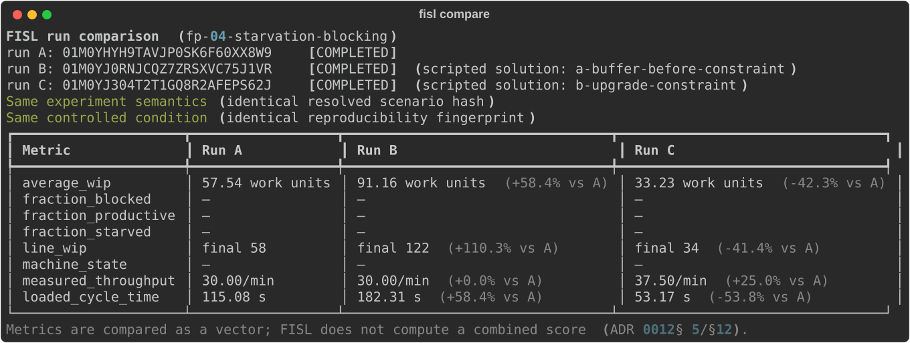

# Lab 4 — Starvation and Blocking

**Scenario:** `fp-04-starvation-blocking` · runs of ~12 minutes each

In Lab 3 every machine had the same story: one bottleneck at the head of
the line, one queue in front of it. This lab's line is quieter and
stranger: three machines of *different* speeds, and the slow one is hidden
in the middle. You will diagnose which machine constrains the system
without being told — using only what the machines' behavior betrays — and
then discover that the two obvious fixes are not the same fix at all.

## The system

The same conveyor architecture as Lab 3, compressed: blue **source** chest,
three machines (rough → machined → inspected → finished), orange **sink**
chest. But look closer at the machines — they are not identical models this
time. Their speeds differ, and speed times recipe determines each stage's
appetite:

| Stage | Machine | Recipe time | Seconds per workpiece |
|---|---|---|---|
| M1 (machining) | assembling-machine-3 | 2 s | **1.6 s** |
| M2 (inspection) | assembling-machine-1 | 1 s | **2.0 s** |
| M3 (finishing) | assembling-machine-2 | 1 s | **1.33 s** |

The table is in front of you, so *you* know M2 is the constraint. A learner
walking the factory floor doesn't get this table — and that is the point of
run 1: the machines will tell you anyway.

Three new numbers join WIP, throughput, and cycle time this lab — measured
per machine and pooled across the line, over the measured window:

- **productive fraction** — share of machine-time with real craft progress
  (measured from progress, not from the status lamp);
- **starved fraction** — no progress, waiting for *input*;
- **blocked fraction** — no progress, output has nowhere to *go*.

There is deliberately no single "utilization" number, and there never will
be: you always see which states are counted and against what denominator.

## Run 1 — diagnose

Start the experiment, change nothing, and spend the run walking the line.
The first minutes are calm — the mismatches take a few minutes to express
themselves as full buffers. By mid-run, watch each machine for thirty
seconds (Alt overlay on):

- **M1**: it runs, then halts with its output full, runs again. The short
  belt between M1 and M2 is packed solid. M1 is **blocked** — it *could*
  produce more, but downstream won't accept it.
- **M2**: never stops. Input always waiting, output always drains.
- **M3**: it runs, then sits with an empty input for a beat, runs again.
  M3 is **starved** — it *could* produce more, but upstream won't feed it.

That pattern is the diagnosis signature worth memorizing:

> **Blocked above, starved below — the constraint sits in between.**

You just located a bottleneck without a stopwatch, a spec sheet, or a
single measurement: coupled machines *point at* their constraint. After the
run, `fisl report runs/<run-id>` turns your walking impressions into
numbers — a per-machine table of productive/starved/blocked fractions and
the pooled fractions. Check it against what you saw. Predict first: which
machine shows ~0% idle? Roughly what fraction of the time was M1 blocked?
(Rates say: M1 needs only 1.6 of every 2.0 seconds to keep M2 fed…)

## Run 2 — intervene, two ways

The toolbox holds both remedies. **Choose one per run**, and predict all
three headline numbers *before* pressing Start.

**Intervention A — a buffer.** Splice a chest into the belt just upstream
of M2: pick three belt tiles, replace them with inserter → wooden chest →
inserter (all facing the flow direction). M1's surplus now has somewhere to
go.

**Intervention B — attack the constraint.** Replace M2's slow machine with
the fast assembling-machine-3 from the toolbox (mine the old one, drop the
new one in its place, set the inspection recipe).

Then compare:

```sh
fisl compare runs/<baseline> runs/<intervention>
```

What actually happens — reference runs of the committed solutions, against
a baseline that measured **TH 30.00/min, avg WIP 57.54, CT 115.08 s**:

- **A** makes M1's blocked fraction collapse and its productive fraction
  climb — the machine *looks* healthier. Throughput does not move at all
  (measured: **30.00/min, +0.0%**): M2 never stopped being the constraint,
  and a buffer feeds no one faster. The surplus M1 produces now accumulates
  in the chest for the entire run, so WIP climbs and climbs — average WIP
  **91.16 (+58.4%)**, and *still rising* when the experiment ended (final
  WIP 122 vs the baseline's steady 58) — and cycle time with it: **182.31 s
  (+58.4%)**. Little's Law is not optional. You improved a machine and
  worsened every workpiece.
- **B** moves throughput — measured **37.50/min (+25.0%)**, exactly the
  *next* constraint's rate (M1's 1.6 s). Average WIP fell to **33.23
  (−42.3%)** and cycle time to **53.17 s (−53.8%)** as the pre-constraint
  queue drained. And watch the state signature migrate: M1's blocked time
  vanishes, while M2 and M3 now show starved time. Walk the line again:
  blocked-above/starved-below now points at M1. The method still works;
  the answer moved, because the constraint moved.

## Debrief

- Intervention A raised the pooled productive fraction. Is the system
  better? What single measured number settles it?
- A plant manager rewards each station for high productive time. Which
  intervention does that policy purchase? What does it do to inventory?
- After B, the constraint is M1. What is the *next* action this factory
  should take — and when should it stop upgrading machines? (Look at the
  source: admission is still uncontrolled. Lab 3's pull gate and this
  lab's constraint-hunting eventually meet.)
- In this deterministic world the buffer bought literally nothing but
  inventory. Real factories buy buffers on purpose. What are they paying
  for that this world lacks? (That question is the door to the entire
  variability course.)

## What the simulation assumed away

No variability, no failures: rate mismatches here are constant and
eternal, so any finite buffer before a slower machine fills and any buffer
after it drains. Real systems' buffers absorb *fluctuation* — they earn
productive time back when machines fail or vary. What survives contact
with reality unchanged: buffers never raise the sustained rate above the
constraint's rate, and inventory's price stays denominated in flow time.

<!-- TODO(figure): after the first verified baseline + solution runs, generate
  fisl solutions scenarios/factory-physics/fp04-starvation-blocking --run --json course/data/lab-04-comparison.json --svg course/data/lab-04-comparison.svg
then uncomment. This figure regenerates from run data — never hand-capture it.
{#fig-compare-lab4}
-->

::: {.callout-note collapse="true"}
## Instructor notes

- Reference interventions are committed as
  `scenarios/factory-physics/fp04-starvation-blocking/solutions/`
  (`a-buffer-before-constraint`, `b-upgrade-constraint`); the full lab
  dataset — baseline plus both solutions, compared — regenerates with
  `fisl solutions scenarios/factory-physics/fp04-starvation-blocking --run
  --json course/data/lab-04-comparison.json`. Reference runs (2026-08-26):
  baseline `01M0YHYH9TAVJP0SK6F60XX8W9` (TH 30.00/min, avg WIP 57.54,
  CT 115.08 s — the rate arithmetic hit exactly), buffer
  `01M0YJ0RNJCQZ7ZRSXVC75J1VR`, upgrade `01M0YJ304T2T1GQ8R2AFEPS62J`
  (37.50/min, again exact). Rerun the command after any scenario or
  baseline change and re-check the numbers cited in this chapter.
- Machine-state fractions come from ADR 0007 classification: productive is
  measured *craft progress*, never the status lamp; unknown states surface
  as `unclassified`/coverage rather than disappearing into idle. The
  per-machine table in `fisl report` shows eligibility windows — solution
  B's machine swap is a live demonstration of dynamic entity-set
  membership (ADR 0016).
- Steady state arrives only after the M1→M2 buffer fills (~3–4 min); the
  4-minute warmup exists so the measured window starts stationary. If you
  shorten phases, re-check that.
- Learners who did Lab 3 will ask why the source-side queue is still
  allowed to pack. Correct instinct — tell them to bring their pull gate,
  then ask what it does to M1's *starved* fraction (nothing, until the
  staging allowance is too tight — a lovely extension exercise).
:::
